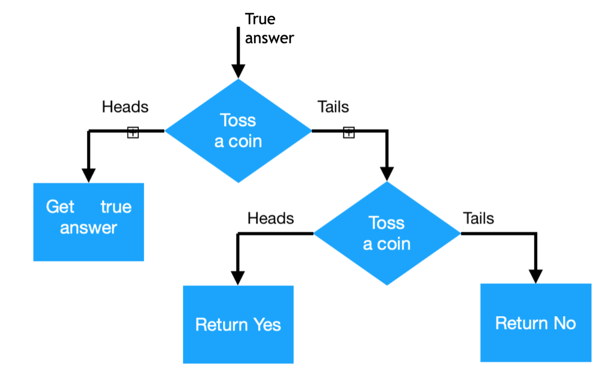

# The Coin Mechanism

If you are here, I suppose you already know the definition of Differential Privacy! Congrats, it's not an easy task, and you managed to have nailed it!

Here we are going to present a didactic example of DP Mechanism, but this will be important in the next chapters, because will help us understand the privacy measurement. The idea of this mechanism was first introduced in the article `Randomized response: A survey technique for eliminating evasive answer bias.` by WARNER, S. L. in 1965.

Imagine you want to make a survey to know how much of the population makes use of illegal drugs. The answer for this can be sensitive, and some people may give you a lying answer. To avoid lies, you say that, when registering the answer (that can be whether `yes` or `no`), you will toss a coin. If the result is `heads`, you save the answer as it was spoken. Otherwise, you toss another coin. If the second coin gives you heads, you save the `yes` answer; if it gives you tails, `no`. For this experiment, we assume that the coin has 50% chance of outputting `yes`, and 50% chance of outputting `no`.

You can have a better visualization of this method in the image below:



## The Coin Mechanism is ln3-differentially private

This mechanism has two possible outputs: `yes` and `no`, and they happen to be the same possibilities for the input. In order to find the 𝜀 for this DP Mechanism, we can write, where M is the Coin Mechanism:

```
𝑃[M(yes) = yes]/𝑃[M(no) = yes] ≤ exp(𝜀)
𝑃[M(no) = yes]/𝑃[M(yes) = yes] ≤ exp(𝜀)
𝑃[M(yes) = no]/𝑃[M(no) = no] ≤ exp(𝜀)
𝑃[M(no) = no]/𝑃[M(yes) = no] ≤ exp(𝜀)
```
Adding the probabilities:

```
(1/2 + 1/4)/(1/4) ≤ exp(𝜀)
(1/4)/(1/2 + 1/4) ≤ exp(𝜀)
(1/4)/(1/2 + 1/4) ≤ exp(𝜀)
(1/2 + 1/4)/(1/4) ≤ exp(𝜀)
```

```
(3/4)/(1/4) ≤ exp(𝜀)
(1/4)/(3/4) ≤ exp(𝜀)
(1/4)/(3/4) ≤ exp(𝜀)
(3/4)/(1/4) ≤ exp(𝜀)
```

Using only the most restricting cases, we can simplify writing:
```
3 ≤ exp(𝜀)
```

And, finally, in the worst case:
```
𝜀 = ln(3)
```