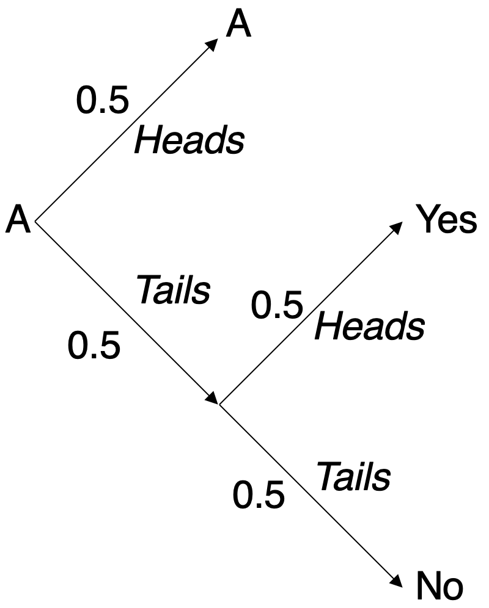
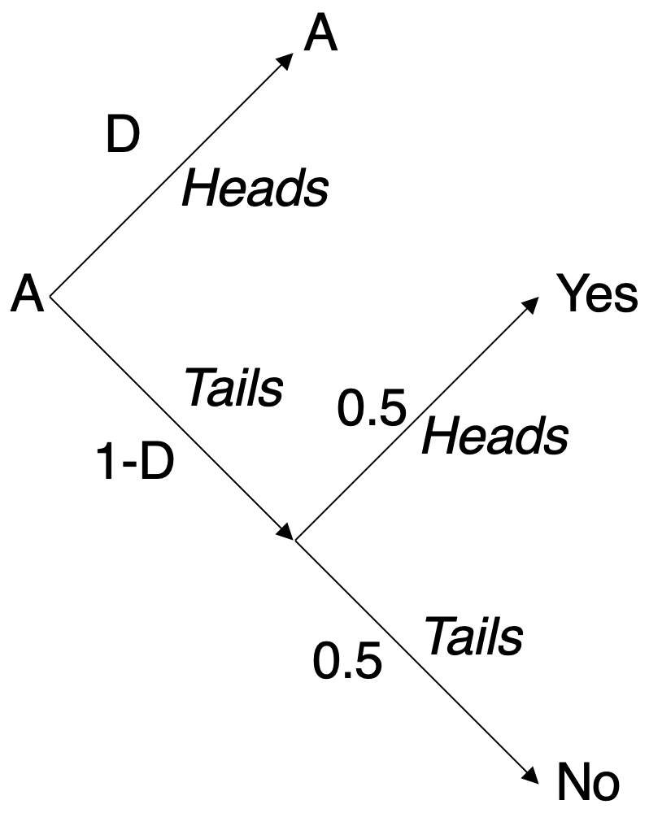

## Davi's Coefficient

By now, you should not only understand the DP definition, but know some DP mechanisms as well. It's awesome that you've learned so much!

But what values of 𝜀 in a 𝜀-differentially private mechanism are good and really preserve the privacy? How to understand the impact of the 𝜀 value?

Thinking about this question, we developed a more intuitive way of understanding such value, and we called it Davi's Coefficient.

Let's remember the Coin Mechanism, presented in the second chapter here. There were two possible coin tosses: the first to define whether or not the answer should be saved as it was spoken. If it was defined that it should be generated by a coin, there was a second coin toss. All tosses, initially, were 50% of chance of outputting heads, just like the image below, where A is the spoken answer:



And we already learned that such mechanism is ln3-differentially private.

We also know that the 𝜀 value is a measurement of the (lack of) privacy in a DP mechanism. And that the same definition of 𝜀 applies to all DP mechanisms.

The good thing about the Coin Mechanism is its relatively easy understanding. So, we decided to change this experiment in order to get different values for 𝜀. The modification we made was in the first coin toss. Instead of getting a 50% chance of getting heads, we decided we would get a D chance of getting heads. In order words, the probability of saving the answer as it was spoken (and not generating it artificially, without the influence of the spoken answer) will be D.



**D is called the Davi's Coefficient and can be calculated based on the 𝜀 value we want to achieve. It represents the chance of saving the answer as is originally was, if a Coin Method with the same privacy level was used.**

## Calculating D based on 𝜀

The formula to find the Davi's coefficient associated with a defined 𝜀 is:

D(𝜀) = [exp(𝜀)-1]/[exp(𝜀)+1]

Demonstration:

The DP constraints are:
```
𝑃[M(yes) = yes]/𝑃[M(no) = yes] ≤ exp(𝜀)
𝑃[M(no) = yes]/𝑃[M(yes) = yes] ≤ exp(𝜀)
𝑃[M(yes) = no]/𝑃[M(no) = no] ≤ exp(𝜀)
𝑃[M(no) = no]/𝑃[M(yes) = no] ≤ exp(𝜀)
```
Adding the probabilities:
```
[D + 0.5*(1-D)]/[0.5*(1-D)] ≤ exp(𝜀)
[0.5*(1-D)]/[D + 0.5*(1-D)] ≤ exp(𝜀)
[0.5*(1-D)]/[D + 0.5*(1-D)] ≤ exp(𝜀)
[D + 0.5*(1-D)]/[0.5*(1-D)] ≤ exp(𝜀)
```
```
(1+D)/(1-D) ≤ exp(𝜀)
(1-D)/(1+D) ≤ exp(𝜀)
(1-D)/(1+D) ≤ exp(𝜀)
(1+D)/(1-D) ≤ exp(𝜀)
```
Using only the most restricting cases, we can simplify writing:
```
(1+D)/(1-D) ≤ exp(𝜀)
```

And, finally, in the worst case:
```
D = [exp(𝜀)-1]/[exp(𝜀)+1]
```

