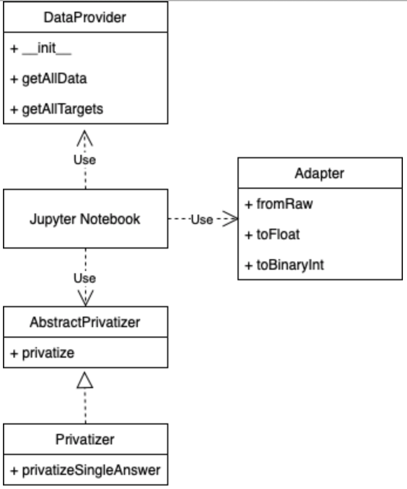

# Differential Privacy Lab Code

Here you'll find all the code and the technical stuff. Feel free to make the changes to best fit your necessities. Let me show you around!

## Architecture

The code was built to be easily extended. You can plug in a new dataset or your own DP Mechanism.

Each Jupyter Notebook has basically 3 dependencies: `DataProvider`, `Adapter` and `Privatizer`. The `DataProvider` is the dataset, with all the information needed and available to the analisys.

`Adapter` is simply a class that adapts the format of the data from `DataProvider` to the format of the `Privatizer`. For a better understand of this class, we recommend you check the tests for the `generalAdapter`, in `adapters/generalTests.py`.

`Privatizer` is the class responsible for implementing the DP Mechanism. All privatizers must inherit from the `AbstractPrivatizer` abstract class. The abstract class implements the `privatize` method, that estimates the sensitivity of the data (when it is not provided) and, for each value, adds the noise. The shape of the noise is implemented inside `privatizeSingleAnswer`.

`privatizeSingleAnswer` is an abstract method in `AbstractPrivatizer`, but it must be implemented by the `Privatizer`. If you want to implement your own, and want a better understand of the API, please check the Laplace Mechanism implementation in `privatizers/laplacePrivatizer.py`.

Here is an UML diagram with a representation of the architecture:

## Tests

Tests are really important in any code development, that's why there are tests for most of the .py files. The script that runs all of the tests is the `runAllTests.sh`. Every time you change something from the existing code, make sure all the tests pass. When implementing new tests, do not forget to include the new files in the `runAllTests.sh` scripts, so we can all enjoy a great continuous development!